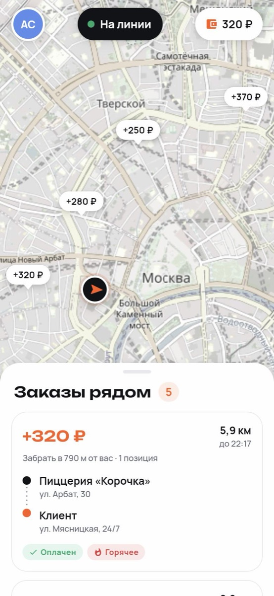
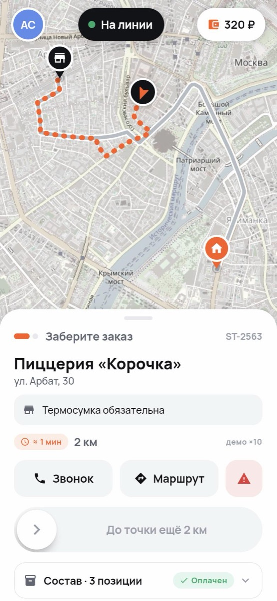
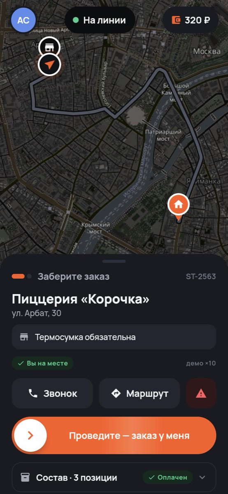
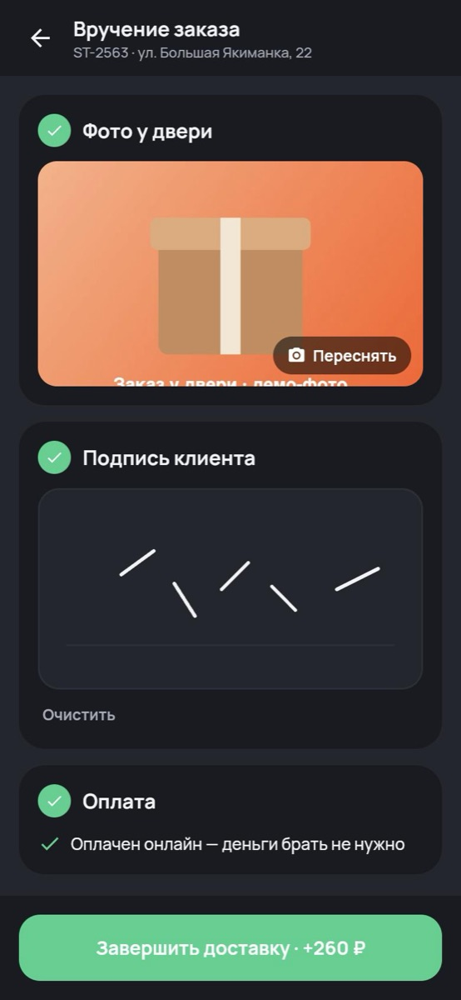
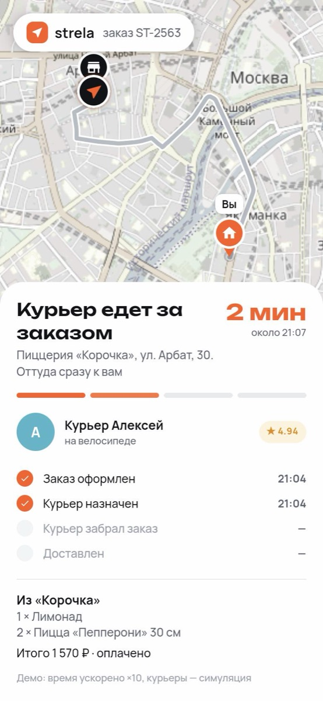
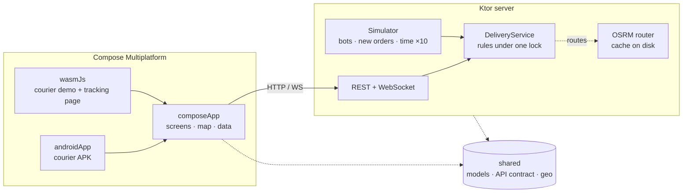

# Strela

[](https://github.com/lobadzip/strela/actions/workflows/ci.yml)
[](https://kotlinlang.org)
[](https://www.jetbrains.com/compose-multiplatform/)
[](https://ktor.io)
[](LICENSE)

**Русская версия: [README.ru.md](README.ru.md)**

A courier delivery product in Kotlin Multiplatform: the courier's Android app, the page a customer
opens to watch their order, and the dispatch server behind both. The UI is written once in Compose and
runs on the phone and in the browser. Built to show what a small delivery business would actually
ship: a map that knows where the bottom sheet ends, a swipe that cannot fire in a pocket, an order
two couriers cannot both grab, and proof of delivery that holds up in a dispute.

<p align="center">
  
  
  
  
  
  
</p>

## Try it

```bash
./scripts/demo.sh          # builds the web app and the server, prints the address for phones on your Wi-Fi
```

Open **http://localhost:8080** on a laptop and you get both sides at once: the courier app on the left,
the customer's tracking page on the right. Sign in as Алексей with the code `0000`, go online, take an
order — and the right-hand phone switches to *your* delivery and follows you down the street.

```bash
./scripts/install-apk.sh   # builds the APK and installs it on a phone connected over USB
```

The APK already knows the laptop's address on the local network, so with `demo.sh` running it simply works.

## What is worth looking at

| | |
|---|---|
| **One UI, two platforms** | Every screen lives in `commonMain`. Android and the browser (Kotlin/Wasm) differ in a handful of `expect`/`actual` functions: camera, location permission, the dialler. [`composeApp/src`](composeApp/src) |
| **A map without a map SDK** | [`TileMap`](composeApp/src/commonMain/kotlin/io/github/lobadzip/strela/app/ui/map/TileMap.kt) is raster tiles on a Compose canvas: Web Mercator, pinch and wheel zoom, ancestor tiles as placeholders, routes as paths, markers as ordinary composables. OpenStreetMap tiles are recoloured by a [colour matrix](composeApp/src/commonMain/kotlin/io/github/lobadzip/strela/app/ui/map/MapStyle.kt) into a calm day map and an inverted night map. No API keys anywhere. |
| **Live, and still alive without sockets** | REST paints the first frame, a WebSocket pushes snapshots after that, and the client reconnects with back-off. The server sends a snapshot only when it actually differs from the last one. [`CourierSession.kt`](composeApp/src/commonMain/kotlin/io/github/lobadzip/strela/app/data/CourierSession.kt) |
| **Race-free dispatch** | One lock around the rules, the router call outside it, and a re-check on commit: whoever loses the race gets "this order was taken" instead of a double booking. [`DeliveryService.kt`](server/src/main/kotlin/io/github/lobadzip/strela/server/dispatch/DeliveryService.kt) |
| **Geofencing** | "Picked up" and "delivered" are accepted only within 150 m of the door. The app shows how far is left and keeps the swipe disabled until then. |
| **Proof of delivery** | A photo, the customer's signature as vector strokes in pad-relative coordinates, and the exact cash amount — or the server refuses. The customer sees the photo on the tracking page. |
| **Private by default** | Orders in the pool show the street but not the flat, the name or the phone; the tracking page never shows phone numbers at all. |
| **A city that runs itself** | The [simulator](server/src/main/kotlin/io/github/lobadzip/strela/server/sim/Simulator.kt) drives couriers along real streets (OSRM routes, cached on disk), lets simulated colleagues take and deliver orders, and keeps new ones coming. Demo time runs ×10, and the UI says so. If a visitor walks away mid-delivery, the autopilot finishes the job. |
| **Money in kopecks** | `Long` everywhere, text only at the edge — the same rule as in [Kopeika](https://github.com/lobadzip/kopeika). |
| **Tested where it counts** | 25 tests: geometry and formatting in common code, dispatch rules, and the HTTP and WebSocket API through Ktor's test host. |

## Stack

Kotlin 2.4 · Compose Multiplatform 1.12 (Android, Kotlin/Wasm) · Material 3 · Ktor 3.5 client and server ·
kotlinx.serialization · coroutines · OkHttp · OpenStreetMap tiles · OSRM · AGP 9 · Gradle 9 with a version catalog

## How it fits together



| Module | What lives there |
|---|---|
| [`shared`](shared) | Models, the API contract (paths and request bodies), geometry, money and time formatting. JVM, Android and Wasm. |
| [`composeApp`](composeApp) | All UI: theme, map, components, screens, the API client and the session state. Android library + Wasm executable. |
| [`androidApp`](androidApp) | The thin Android shell: `Application`, `Activity`, manifest, icon. |
| [`server`](server) | Ktor: REST, WebSockets, business rules, the demo city and the simulator. Serves the web build too. |

## API

| Method | Path | Purpose |
|---|---|---|
| `POST` | `/api/session` | Sign in with phone and code (demo code `0000`) |
| `GET` | `/api/courier` | Everything the courier app shows, in one snapshot |
| `WS` | `/api/courier/live?token=` | The same snapshot, pushed on every change |
| `POST` | `/api/courier/shift` | Go online or offline |
| `POST` | `/api/courier/location` | Real GPS fixes, or hand driving back to the simulator |
| `POST` | `/api/orders/{id}/accept` · `/pickup` · `/deliver` · `/fail` | The delivery lifecycle |
| `GET` | `/api/track/{code}` | The customer's view of one order |
| `WS` | `/api/track/{code}/live` | Live updates for the tracking page |
| `GET` | `/api/photos/{id}` | Proof-of-delivery photo |
| `GET` | `/api/demo/couriers` · `/api/demo/live` · `/api/demo/stats` | Demo helpers |

Errors are JSON with a stable `code` and a `message` written for the courier, not for a log file:

```json
{ "code": "too_far", "message": "Вы ещё не на месте: до точки 600 м" }
```

## Running it

**Demo on the local network** — `./scripts/demo.sh`, as above.

**Docker**

```bash
docker build -t strela . && docker run -p 8080:8080 strela
```

**Tests**

```bash
./gradlew :shared:jvmTest :server:test
```

**Configuration** (environment variables of the server)

| Variable | Default | |
|---|---|---|
| `PORT` | `8080` | |
| `STRELA_SPEEDUP` | `10` | How much faster demo time runs |
| `STRELA_OSRM_URL` | public OSRM | `off` draws straight lines and needs no network |
| `STRELA_SEED` | random | Makes the demo city reproducible |
| `STRELA_WEB_DIR` | the Wasm build | Where the web app is served from |
| `STRELA_DATA_DIR` | `./data` | Route cache |

The Android build bakes in this computer's LAN address as the default server; override it with
`-Pstrela.serverUrl=https://…`, or change it on the sign-in screen.

## Honest limitations

- Demo state lives in memory: a restart is a fresh city. A production version would keep orders in
  PostgreSQL the way Kopeika does.
- Sign-in is demo-grade: a known phone and a fixed code, no SMS.
- The public OpenStreetMap tile servers and the OSRM demo router are fine for a portfolio, not for a
  fleet: a real product would run its own or pay a provider.
- No iOS build yet: the UI is Compose Multiplatform and would run there, but building needs Xcode.
- Real GPS works, but the demo city is central Moscow, so it is mostly useful there.

## Credits

Map data © [OpenStreetMap](https://www.openstreetmap.org/copyright) contributors · routes by
[OSRM](https://project-osrm.org) · fonts [Manrope](https://github.com/sharanda/manrope) and
[Unbounded](https://unbounded.design) under the [SIL Open Font License](docs/licenses).
Shops in the demo city are made up; the streets are real.

## License

[MIT](LICENSE)
