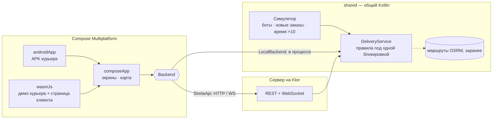

# Strela

[](https://github.com/lobadzip/strela/actions/workflows/ci.yml)
[](https://kotlinlang.org)
[](https://www.jetbrains.com/compose-multiplatform/)
[](https://ktor.io)
[](LICENSE)

**English version: [README.md](README.md)**

Курьерская доставка на Kotlin Multiplatform: Android-приложение курьера, страница, на которой клиент
следит за заказом, и диспетчерский сервер за ними. Интерфейс написан один раз на Compose и работает
и на телефоне, и в браузере. Проект показывает, что на самом деле нужно небольшому бизнесу доставки:
карта, которая знает, где заканчивается шторка; свайп, который не сработает в кармане; заказ, который
не смогут взять двое курьеров сразу; подтверждение вручения, с которым можно разбирать спор.

<p align="center">
  
  
  
  
  
  
</p>

## Как попробовать

**[lobadzip.github.io/strela](https://lobadzip.github.io/strela/)** — откройте на ноутбуке и увидите обе
стороны сразу: слева приложение курьера, справа страницу клиента. Войдите как Алексей с кодом `0000`,
выйдите на линию, примите заказ — и правый телефон переключится на *вашу* доставку и поедет за вами по
улицам. С телефона та же ссылка открывает само приложение курьера.

**Android:** APK из [Releases](https://github.com/lobadzip/strela/releases) работает сам по себе — демо-город
живёт внутри приложения, ничего настраивать не нужно, сервер не нужен.

Оба варианта выполняют правила доставки и симулятор у себя; тот же код работает и как настоящий бэкенд:

```bash
./scripts/demo.sh          # собирает веб-версию и сервер на Ktor, печатает адрес для телефонов в той же Wi-Fi
./scripts/install-apk.sh   # собирает APK и ставит его на телефон, подключённый по USB
```

В приложении *экран входа → «Город: демо на устройстве · изменить»* переключает его на этот сервер.

## На что посмотреть

| | |
|---|---|
| **Один код, три среды** | Правила доставки и симулятор — обычный общий Kotlin в [`shared`](shared/src/commonMain/kotlin/io/github/lobadzip/strela/core). Сервер на Ktor выполняет их за HTTP; Android-приложение и браузер выполняют те же самые классы у себя, за тем же интерфейсом [`Backend`](composeApp/src/commonMain/kotlin/io/github/lobadzip/strela/app/data/Backend.kt) — поэтому веб-демо является статическим сайтом, а APK работает без сети. |
| **Один интерфейс, две платформы** | Все экраны лежат в `commonMain`. Android и браузер (Kotlin/Wasm) различаются горсткой функций `expect`/`actual`: камера, разрешение на геолокацию, звонок. [`composeApp/src`](composeApp/src) |
| **Карта без SDK карт** | [`TileMap`](composeApp/src/commonMain/kotlin/io/github/lobadzip/strela/app/ui/map/TileMap.kt) — растровые тайлы на канвасе Compose: проекция Web Mercator, зум щипком и колесом, тайлы-предки как заглушки, маршруты как пути, маркеры — обычные composable. Тайлы OpenStreetMap перекрашиваются [цветовой матрицей](composeApp/src/commonMain/kotlin/io/github/lobadzip/strela/app/ui/map/MapStyle.kt) в спокойную дневную и инвертированную ночную карту. Никаких ключей API. |
| **Живые данные, даже без сокетов** | Первый кадр рисует REST, дальше снимки состояния приносит WebSocket, при обрыве клиент переподключается с нарастающей паузой. Сервер шлёт снимок только тогда, когда он действительно изменился. [`CourierSession.kt`](composeApp/src/commonMain/kotlin/io/github/lobadzip/strela/app/data/CourierSession.kt) |
| **Без гонок за заказ** | Правила под одной блокировкой, запрос маршрута — вне её, при записи — повторная проверка: проигравший гонку получает «заказ уже забрал другой курьер», а не двойное назначение. [`DeliveryService.kt`](shared/src/commonMain/kotlin/io/github/lobadzip/strela/core/DeliveryService.kt) |
| **Геозоны** | «Забрал» и «вручил» принимаются только в пределах 150 м от двери. Приложение показывает, сколько осталось, и до тех пор держит свайп выключенным. |
| **Подтверждение вручения** | Фото, подпись клиента векторными штрихами в относительных координатах и точная сумма наличных — иначе сервер откажет. Клиент видит фото на странице отслеживания. |
| **Приватность по умолчанию** | В ленте заказов видна улица, но не квартира, имя и телефон; на странице клиента телефонов нет вообще. |
| **Город живёт сам** | [Симулятор](shared/src/commonMain/kotlin/io/github/lobadzip/strela/core/Simulator.kt) водит курьеров по настоящим улицам, даёт виртуальным коллегам брать и доставлять заказы, подкидывает новые. Все маршруты, какие может породить город, [заранее получены из OSRM](server/src/main/kotlin/io/github/lobadzip/strela/server/routing/BakeRoutes.kt) и лежат в приложении файлом закодированных полилиний на 230 КБ. Время в демо идёт ×10, и интерфейс это честно пишет. Если посетитель бросит заказ на полпути, автопилот его довезёт. |
| **Деньги в копейках** | Везде `Long`, текстом — только при показе. То же правило, что в [Kopeika](https://github.com/lobadzip/kopeika). |
| **Тесты там, где важно** | 28 тестов: геометрия, кодирование полилиний и форматирование в общем коде, правила доставки, HTTP- и WebSocket-API через тестовый хост Ktor. |

## Стек

Kotlin 2.4 · Compose Multiplatform 1.12 (Android, Kotlin/Wasm) · Material 3 · Ktor 3.5 (клиент и сервер) ·
kotlinx.serialization · корутины · OkHttp · тайлы OpenStreetMap · OSRM · AGP 9 · Gradle 9 с каталогом версий

## Как всё связано



| Модуль | Что внутри |
|---|---|
| [`shared`](shared) | Правила доставки, демо-город и симулятор; модели, контракт API, геометрия, форматирование денег и времени. JVM, Android и Wasm. |
| [`composeApp`](composeApp) | Весь интерфейс: тема, карта, компоненты, экраны; состояние сессии и оба бэкенда. Android-библиотека + Wasm-приложение. |
| [`androidApp`](androidApp) | Тонкая Android-оболочка: `Application`, `Activity`, манифест, иконка. |
| [`server`](server) | Ktor: REST и WebSocket поверх общих правил, живой маршрутизатор OSRM и «запекатель» маршрутов. Он же раздаёт веб-сборку. |

## API

| Метод | Путь | Назначение |
|---|---|---|
| `POST` | `/api/session` | Вход по телефону и коду (демо-код `0000`) |
| `GET` | `/api/courier` | Всё, что показывает приложение курьера, одним снимком |
| `WS` | `/api/courier/live?token=` | Тот же снимок, присылается при каждом изменении |
| `POST` | `/api/courier/shift` | Выйти на линию или уйти с неё |
| `POST` | `/api/courier/location` | Координаты реального GPS — или вернуть управление симулятору |
| `POST` | `/api/orders/{id}/accept` · `/pickup` · `/deliver` · `/fail` | Жизненный цикл доставки |
| `GET` | `/api/track/{code}` | Заказ глазами клиента |
| `WS` | `/api/track/{code}/live` | Живые обновления для страницы клиента |
| `GET` | `/api/photos/{id}` | Фото вручения |
| `GET` | `/api/demo/couriers` · `/api/demo/live` · `/api/demo/stats` | Помощники для демо |

Ошибки — JSON со стабильным `code` и `message`, написанным для курьера, а не для лога:

```json
{ "code": "too_far", "message": "Вы ещё не на месте: до точки 600 м" }
```

## Запуск

**Демо в локальной сети** — `./scripts/demo.sh`, как выше.

**Docker**

```bash
docker build -t strela . && docker run -p 8080:8080 strela
```

**Тесты**

```bash
./gradlew :shared:jvmTest :server:test
```

**Настройки** (переменные окружения сервера)

| Переменная | По умолчанию | |
|---|---|---|
| `PORT` | `8080` | |
| `STRELA_SPEEDUP` | `10` | Во сколько раз быстрее идёт время в демо |
| `STRELA_OSRM_URL` | публичный OSRM | `off` — прямые линии, сеть не нужна |
| `STRELA_SEED` | случайный | Делает демо-город воспроизводимым |
| `STRELA_WEB_DIR` | Wasm-сборка | Откуда раздавать веб-приложение |
| `STRELA_DATA_DIR` | `./data` | Кеш маршрутов, которых нет в заранее подготовленном файле |

Android-сборка запускается как самостоятельное демо и при переключении на сервер предлагает адрес этого
компьютера в локальной сети; подсказку можно переопределить через `-Pstrela.serverUrl=https://…`.

**Пересчёт маршрутов** после правок демо-города: `./gradlew :server:bakeRoutes` (около десяти минут:
публичный маршрутизатор разрешает один запрос в секунду).

## Честные ограничения

- Состояние демо живёт в памяти: перезапуск — новый город. В рабочей версии заказы хранились бы в
  PostgreSQL, как в Kopeika.
- В статическом веб-демо у каждой вкладки свой город, поэтому ссылка отслеживания имеет смысл только
  внутри неё (страница с двумя телефонами это и показывает). За сервером на Ktor ссылки работают между
  устройствами.
- Вход демонстрационный: известный номер и фиксированный код, без СМС.
- Публичные тайлы OpenStreetMap и демо-маршрутизатор OSRM годятся для портфолио, но не для автопарка:
  настоящему продукту нужен свой сервер или платный провайдер.
- Сборки под iOS пока нет: интерфейс на Compose Multiplatform запустится и там, но для сборки нужен Xcode.
- Реальный GPS работает, но демо-город — центр Москвы, так что пользоваться им имеет смысл там.

## Благодарности

Картографические данные © участники [OpenStreetMap](https://www.openstreetmap.org/copyright) ·
маршруты [OSRM](https://project-osrm.org) · шрифты [Manrope](https://github.com/sharanda/manrope) и
[Unbounded](https://unbounded.design) под [SIL Open Font License](docs/licenses).
Магазины в демо-городе выдуманы, улицы настоящие.

## Лицензия

[MIT](LICENSE)
